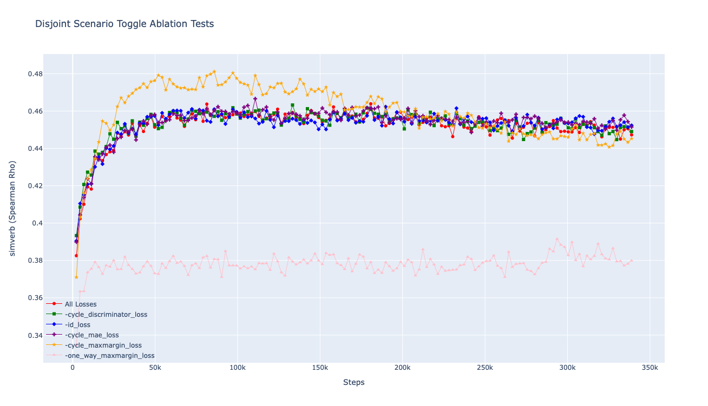
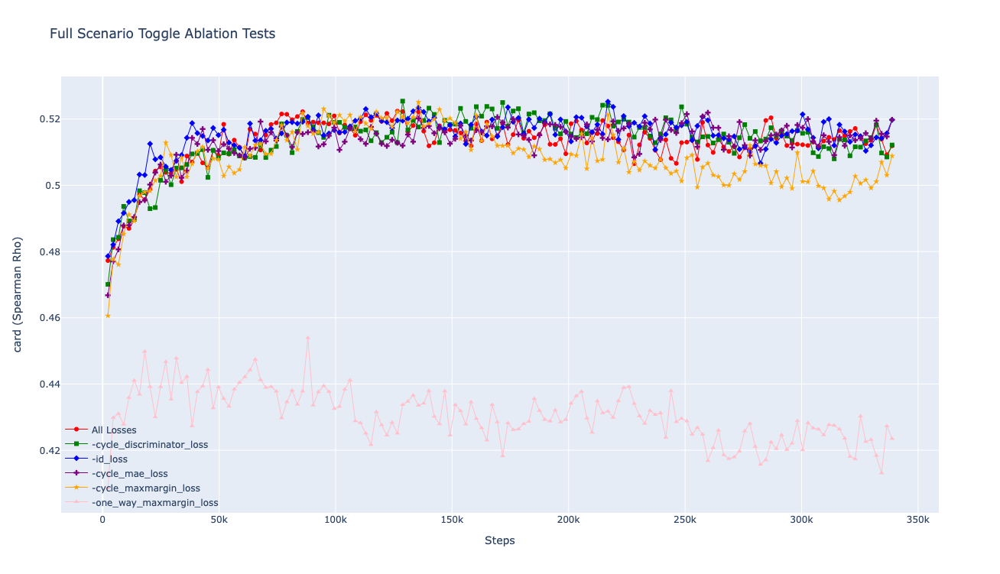

# RetroGAN
Code for paper: RetroGAN: A Cyclic Post-Specialization System for Improving Out-of-Knowledge and Rare Word Representations 
coming out in ACL FINDINGS 2021.
## Getting Started
1. Create an environment with conda 
   >conda create -n retrogan python=3.8
2. Activate the environment
   >conda activate retrogan
3. Install requirements:
   >cd Code
   > 
   >pip install -r requirements.txt
4. Run experiments:
   >python retrogan_trainer.py --epochs 150 ../Data/ft_all_unseen.txt ../Data/ft_all_unseen_retrofitted.txt retrogan_nb_full_50epochs_alllosses models/retrogan_nb_full_50epochs_alllosses

## Parameter Tuning
To run the parameter fine tuning, after installing the requirements, run:
> python rg_ray_parameter_tuning.py

NOTE: It may be the case that you run into an error with the msgpack library (something about an unknown argument), if that is the case, uninstall, and reinstall the msgpack libary:
> pip uninstall msgpack
> 
> pip install msgpack
## Tests
You can also run the ablation, full/disjoint, and percentage tests that were reported in the paper with the respective scripts:
* ablationtests.sh
* full_and_oov_tests.sh
* oovtests.sh

## Expected results
Here is a table with the expected results:

## Ablation study results
### One by one removal
Here is a higher resolution version of the plots given in ablation study.

These results can be generated by running the script:
> cd Scripts
> 
> sh ablationtests.sh
### Toggling of losses
Here is a higher resolution version of the plots given in the toggle ablation study

These results can be generated by running the script:
> cd Scripts
> 
> sh ablationtests-2.sh
## Citing
TBD